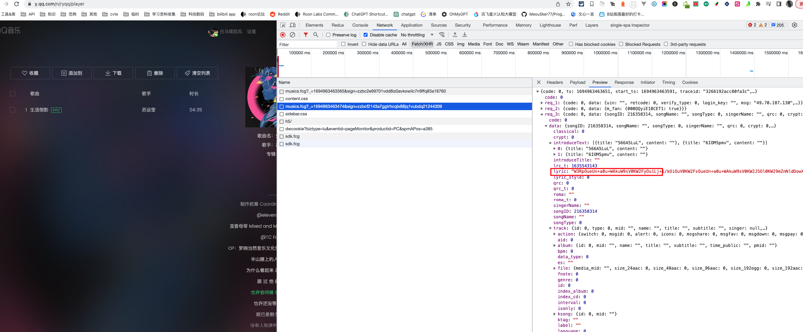
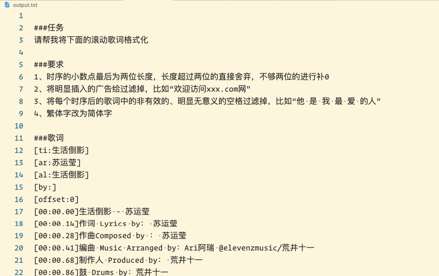
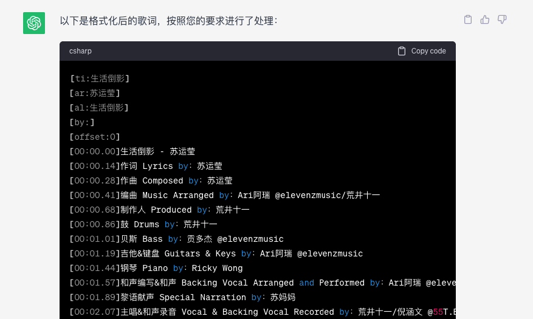
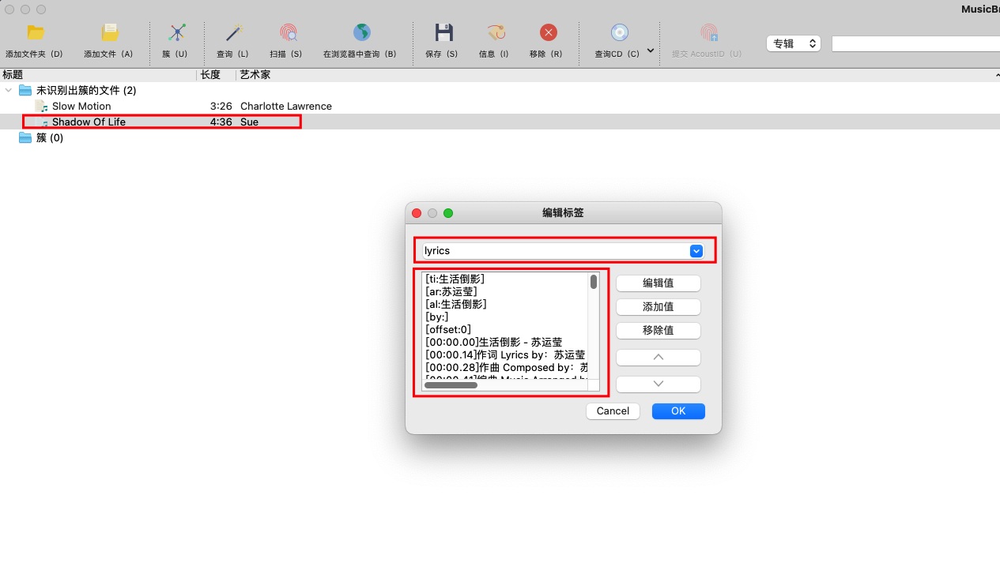
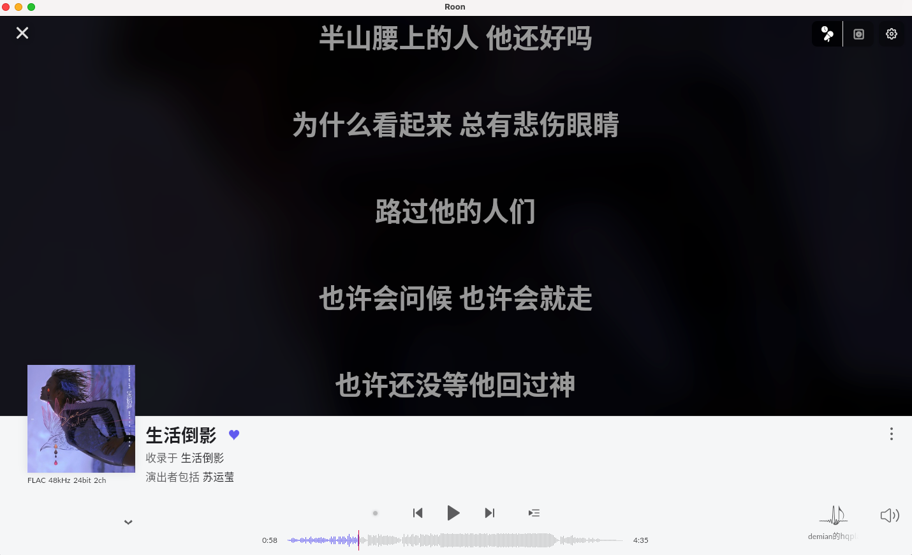

# 简介

爬取 qq 音乐的歌词，生成滚动歌词文件，写入到本地的 hires 音源文件中。

## 操作步骤

### 一、安装

```shell
npm install
npm link
```

### 二、测试

```shell
lyric
```

此时命令行会打印消息，以等待输入 base64 字符串


### 三、获取 base64 信息并执行程序

爬虫不会的话写可以请教一下 chatgpt 老师，这里说下如何手动获取 base64 数据，以及后续的执行步骤:

#### 1. 打开 chrome 控制台，在 network 的如下请求中找到 lyric 字段



#### 2. 拷贝出 base64 数据，粘贴到命令行，回车执行

#### 3. 在当前目录找到转换后的文件 `output.txt`，然后拷贝出整体内容



> 注意：这里有些要求是 roon 才需要的

#### 4. 复制到 chatgpt，让 chatgpt 进行歌词优化

效果：



#### 5. 将优化后的歌词传入到 musicbrainz picard 软件，和 nas 中的音频文件进行 lyric 字段绑定。



#### 6. 进入 roon 中查看效果

